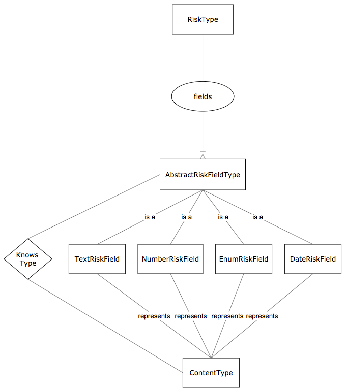

# BriteCore Test
A project that explores dynamic data modeling for insurance risk types. Built using Django app server with REST API
using Django Rest Framework, Vue.js frontend using Vuetify componenet, and deployed on AWS via Zappa

## Developing
django-admin's `runserver` and webpack dev server are used for development

### Prerequisites
Requires python/pip and node/npm

### Setting up Dev
```shell
git clone https://github.com/Citizen-Thayne/brite-core-test.git
cd brite-core-test/
pip install -r requirements.txt
npm install
```
Using `virtualenv` is highly recommended

### Building

Webpack is used to build frontend assets and put them in `static/`
```shell
npm run build
python manage.py collectstatic --noinput
```

### Running Dev Tools
```shell
python manage.py runserver & npm run dev
```
Open http://localhost:8082

This runs a local Django server and webpack dev server. A proxy is used to
forward REST API requests to the django server.

### Deploying 
Zappa is used to deploy an AWS Lambda function and `deploy.sh` takes care of building and deploying
```shell
./deploy
```

And again you'd need to tell what the previous code actually does.


## Configuration
Some AWS settings will need to be change from my settings for other to deploy to their clouds
### zappa_settings.json
1. Change `s3_bucket` to your bucket 
2. (Optional) Change `aws_region`
### vuedj.settings_prod.py
1. Add your host to `ALLOWED_HOSTS`
2. Change `AWS_STORAGE_BUCKET_NAME` to your bucket for static assets

## Tests
```shell
python manage.py test
```

## Api Reference
Comes with two REST API endpoints
- `/api/risktypes/`
- `/api/risktypes/{id}`

## Database
SQLite was used for simplicity but MySQL or some other DB could be used to power the lambda
function

### Models
- RiskType
- AbstractRiskFieldType
- TextRiskField
- NumberRiskField
- EnumRiskField
- DateRiskField

### Design
This solution achieves the ability to define risk type models dynamically without requiring tables for each. This is done by abstracting out each data field on a risk as an **AbstractRiskFieldType**. This model has a foreign relationship to a **RiskType** instance that represents the risk as a table row instead of a whole table. From here, each field data type model can inherit from 
**AbstractRiskFieldType** and implement its own details (e.g. min_length in the case of **TextRiskField** and values in the case 
of **EnumRiskField**). 

After concrete field types are defined, RiskType instances can be composed of any number and type of avaiable field types. 
With the help of **SubclassingQuerySet** and **RiskTypeFieldManager**, RiskType instances can elicit their fields' concrete field
types. This is useful in the case of the REST API that requires detailing of each field type data type so that the frontend can
choose the correct input widget to use. 

### Entity Relationship Diagram


